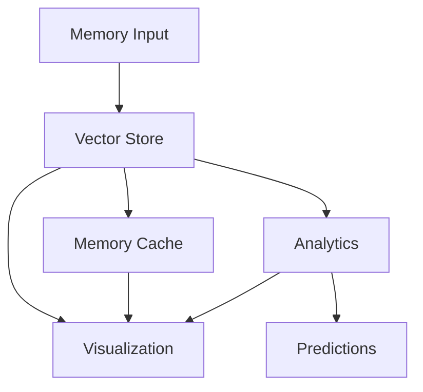
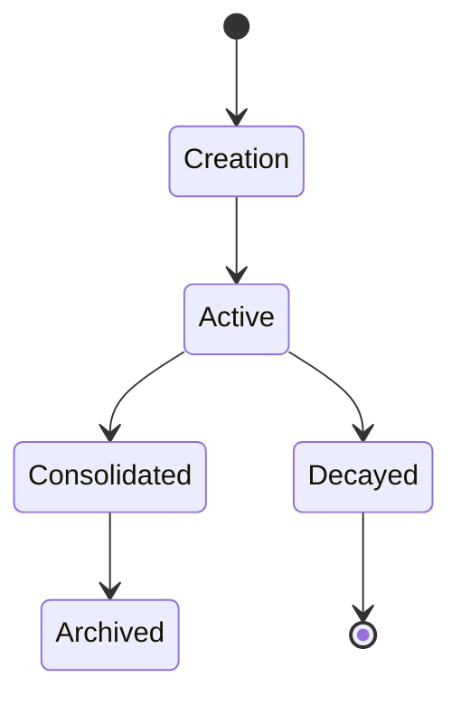
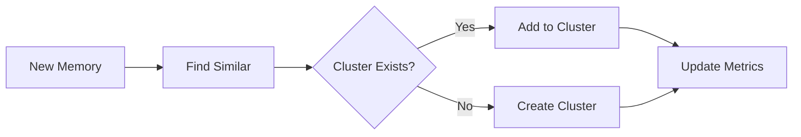
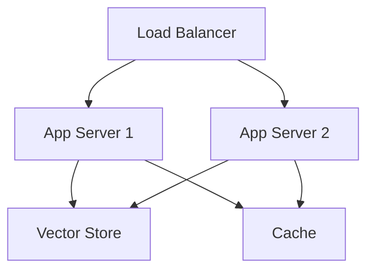

# ArgOS System Architecture

## Overview

ArgOS is a sophisticated agent simulation system built on BitECS, featuring autonomous agents with advanced cognitive architectures. This document outlines the system's architecture, components, and their interactions.

## System Components

### 1. Core Layer

```
src/lib/
├── vectorStore.ts        # Vector storage and retrieval
├── types/               # Core type definitions
└── utils/               # Utility functions
```

The core layer provides fundamental data structures and operations:
- Vector storage and similarity search
- Memory management and persistence
- Type definitions and interfaces

### 2. Memory Management

```
src/lib/optimizations/
├── memoryCacheManager.ts     # Memory caching system
├── datasetPartitioner.ts     # Dataset partitioning
├── workerPool.ts            # Thread management
└── virtualizer.ts           # Virtual rendering
```

Memory optimization features:
- High-performance caching
- Efficient data partitioning
- Parallel processing
- Virtual rendering for large datasets

### 3. Analytics Layer

```
src/lib/analytics/
├── predictiveAnalytics.ts    # AI-driven predictions
├── metricCalculator.ts       # System metrics
├── datasetStatistics.ts      # Statistical analysis
└── correlationAnalyzer.ts    # Pattern detection
```

Analytics capabilities:
- Predictive modeling
- Performance metrics
- Statistical analysis
- Pattern recognition

### 4. Visualization Layer

```
src/components/
└── MemoryVisualizer.tsx     # Memory visualization
```

Visualization features:
- Interactive cluster view
- Real-time updates
- Comparative analysis
- Performance optimization

## Data Flow



1. Memory ingestion through Vector Store
2. Caching for frequent access
3. Analytics processing
4. Visualization updates

## Memory Architecture

### Memory Types

1. **Episodic Memories**
   - Event-based memories
   - Temporal context
   - Emotional associations

2. **Semantic Memories**
   - Conceptual knowledge
   - Relationship networks
   - Abstract representations

3. **Procedural Memories**
   - Action sequences
   - Skill representations
   - Behavioral patterns

### Memory Lifecycle



## Clustering System

### Cluster Formation

1. Vector similarity analysis
2. Dynamic cluster creation
3. Automatic optimization
4. Merge/split operations

### Cluster Maintenance



## Performance Optimization

### Caching Strategy

1. **Multi-level Cache**
   - L1: In-memory cache
   - L2: Persistent cache
   - L3: Vector store

2. **Cache Management**
   - LRU eviction
   - Size-based cleanup
   - Access pattern optimization

### Parallel Processing

1. **Worker Pool**
   - Dynamic scaling
   - Task distribution
   - Resource management

2. **Data Partitioning**
   - Spatial partitioning
   - Load balancing
   - Partition optimization

## Security Considerations

### Data Protection

1. Memory encryption
2. Access control
3. Audit logging

### System Security

1. Input validation
2. Error handling
3. Rate limiting

## Monitoring and Metrics

### System Metrics

1. Memory usage
2. CPU utilization
3. Operation latency

### Memory Metrics

1. Access patterns
2. Decay rates
3. Cluster stability

## Error Handling

### Error Types

1. **Operational Errors**
   - Memory operations
   - Cluster operations
   - Cache operations

2. **System Errors**
   - Resource limits
   - Connection failures
   - Worker crashes

### Recovery Strategies

1. Automatic retry
2. Graceful degradation
3. State recovery

## Development Considerations

### Code Organization

```
project/
├── src/
│   ├── lib/
│   ├── components/
│   └── types/
├── tests/
├── docs/
└── examples/
```

### Best Practices

1. Type safety
2. Error handling
3. Performance optimization
4. Testing coverage

## Deployment Architecture

### Production Setup



### Scaling Strategy

1. Horizontal scaling
2. Load balancing
3. Cache distribution

## Future Considerations

1. **Scalability**
   - Distributed processing
   - Sharding strategy
   - Load balancing

2. **Features**
   - Advanced analytics
   - Real-time processing
   - Enhanced visualization

3. **Integration**
   - External systems
   - APIs
   - Data sources
